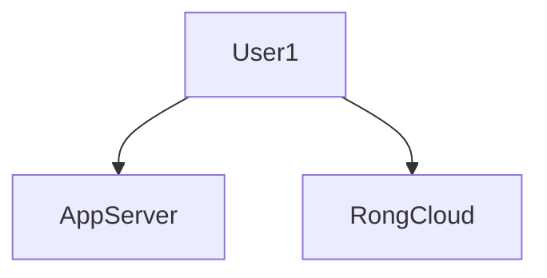
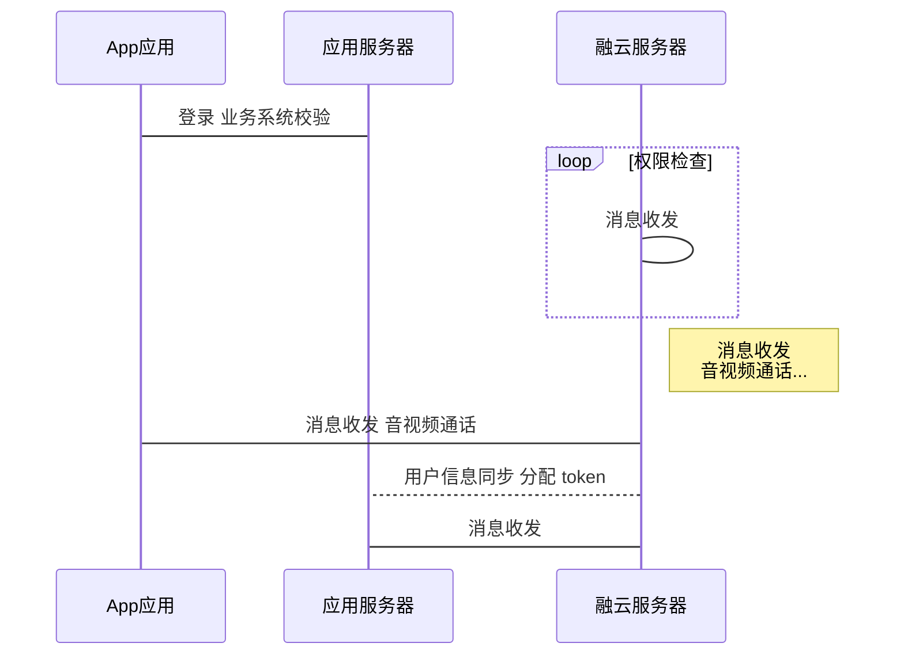
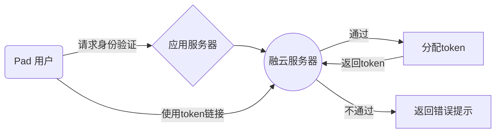

# markdown flow
1. markdown flow： https://mermaidjs.github.io/
2. web页面： https://shuise.github.io/tech-research/md-page/flow.html

3. markdown 编辑器：[https://typora.io](https://typora.io/) 支持 windows、mac、linux


## plant uml


Class Stage
    Class Timeout {
        +constructor:function(cfg)
        +timeout:function(ctx)
        +overdue:function(ctx)
        +stage: Stage
    }
    Stage <|-- Timeout



## terminal

```
**[terminal]
**[prompt foo@joe]**[path ~]**[delimiter  $ ]**[command ./myscript]
Normal output line. Nothing special here...
But...
You can add some colors. What about a warning message?
**[warning [WARNING] The color depends on the theme. Could look normal too]
What about an error message?
**[error [ERROR] This is not the error you are looking for]
```


# flow




# sequenceDiagram




#demo

