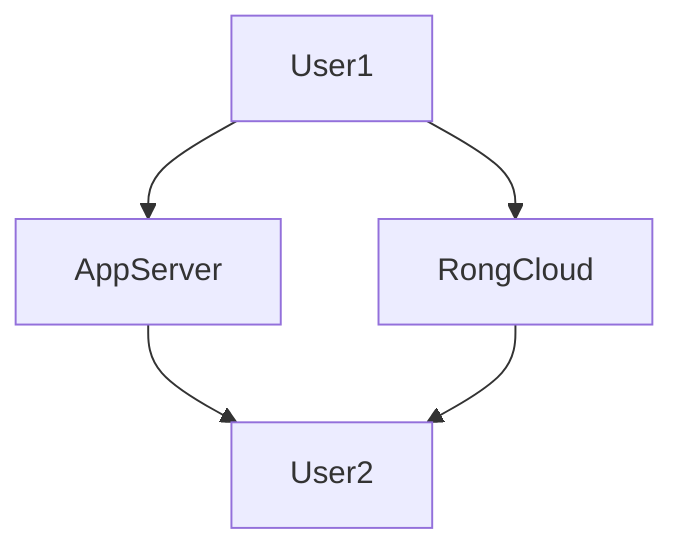

# markdown flow
1. markdown flow： https://mermaidjs.github.io/
2. web页面： https://shuise.github.io/tech-research/md-page/flow.html

3. markdown 编辑器：[https://typora.io](https://typora.io/) 支持 windows、mac、linux

# flow

# sequenceDiagram

#demo

